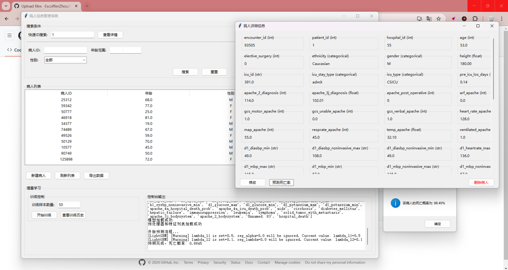
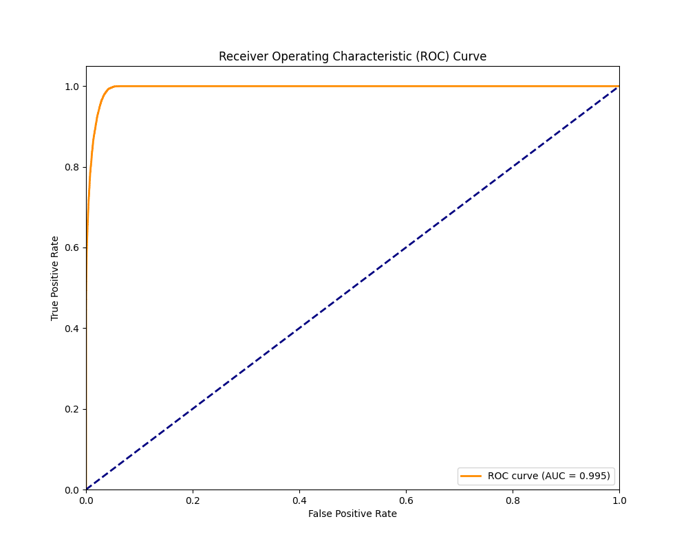
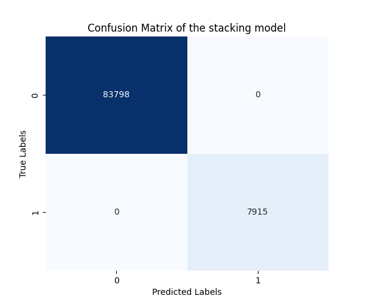

# 重症监护病人预后预测系统


## 项目简介
这是一个基于机器学习的重症监护病人预后预测系统，可以帮助医生评估病人的死亡风险。系统采用了堆叠集成学习方法，结合了随机森林和LightGBM模型，并支持增量学习功能。
使用的数据集来源于Kaggle开源数据集:https://www.kaggle.com/datasets/mitishaagarwal/patient
(AI02 - 212 Group project , 项目归属于0413学号组长)

>   ```txt
>   1.对于高风险病人(实际死亡的病人)，模型给出了很高的死广概率(92.81%和95.59%)
>   2.对于低风险病人(实际存活的病人)，模型给出了很低的死亡概率(6.24%和2.79%)
>   3.对于随机病人，模型也给出了合理的预测(2.75%和6.14%)
>   ```

- 

## 主要功能
1. 病人信息管理
   - 病人信息的增删改查
   - 支持多条件组合搜索
   - 列表排序和导出功能
   - 详细信息查看和编辑

2. 死亡风险预测
   - 基于多个临床指标的死亡风险预测
   - 实时预测结果展示
   - 预测结果可解释性展示

3. 增量学习功能
   - 支持模型在线更新
   - 可自定义训练样本数量
   - 训练过程实时监控
   - 训练历史记录查看

## 技术栈
- 前端界面：Python Tkinter
- 数据处理：Pandas, NumPy
- 机器学习：
  - Scikit-learn (随机森林、KNN填充、标准化)
  - LightGBM (梯度提升树)
  - 堆叠集成学习
- 数据存储：CSV文件系统
- 版本控制：Git

## 系统架构
```
src/
├── backend/
│   ├── data/           # 数据文件
│   ├── model/          # 模型文件
│   ├── EventMonitor.py # 主界面
│   ├── SinglePatient.py # 病人信息处理
│   ├── DatabaseManager.py # 数据管理
│   ├── PatientDetailWindow.py # 详情窗口
│   ├── IncrementalLearning.py # 增量学习
│   └── 0TrainingCode.py # 模型训练
└── test/
    ├── test_prediction.py # 预测测试(自动化脚本)
    └── test_patient_update.py # 更新测试
```

## 模型性能
- AUC Score: 0.9949

- 准确率: 94.23%

- 支持实时增量更新

- 

- 


## 安装说明
1. 克隆项目
```bash
git clone https://github.com/EscoffierZhou/Patient_Death_Prediction.git
cd Patient_Death_Prediction
```

2. 安装依赖
```bash
pip install -r requirements.txt
```

3. 运行系统
```bash
python src/backend/EventMonitor.py
```

## 使用说明
1. 病人管理
   - 点击"新建病人"添加病人信息
   - 使用搜索框进行病人检索
   - 双击病人记录查看详细信息
   - 在详情页面可以修改信息或预测死亡风险

2. 死亡风险预测
   - 在病人详情页面点击"预测死亡率"
   - 系统会实时计算并显示预测结果

3. 增量学习
   - 在主界面底部设置训练样本数量
   - 点击"开始训练"进行模型更新
   - 通过"查看训练历史"了解模型性能变化

## 注意事项
1. 首次运行需要完整的训练数据集
2. 增量学习建议每次使用适量数据（如50-100条）
3. 定期备份数据文件
4. 监控模型性能变化

## 开发团队
- 开发者：Escoffier Zhou
- 联系方式：a3416270780@gmail.com

## 许可证
本项目采用 MIT 许可证。详见 [LICENSE](LICENSE) 文件。

## 版权声明
Copyright (c) 2023 Escoffier Zhou. All rights reserved.

本项目受 MIT 许可证保护。在遵守许可证条款的前提下，您可以自由使用、修改和分发本软件。

## 更新日志
### v1.0.0 (2023-12-13)
- 完成基础功能开发
- 实现增量学习功能
- 添加训练历史记录
- 优化用户界面

